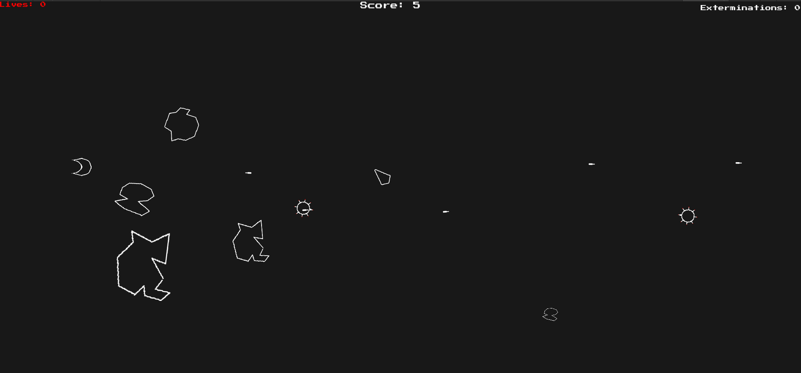

# AsteroidsUnity

    </img>

## Description:

This is my (another) take on classic arcade game "Asteroids". This time I made it with the Unity engine and C#, both of which I know nothing. 
Current version offers:
- 3 levels of difficulty
- 6 power ups
- handcrafted (in Krita) with love asteroids and enemies
- great, atmospheric soundtrack made with blessing of https://onlinesequencer.net/
- it sort of works

## Point of this madness:

I made it just to have some fun with c#, so it's not very… ambitious, but It’s still sort of fun! Rules are simple: Dodge asteroids and enemy bullets to stay alive and destroy them for points. That task might be made easier (or harder) by picking power ups... Basically a rouglike! Currently there is only one level, and no progress at all (other than beating high scores) and at this point I don’t think I’ll ever update it – if anything, I’ll just make a new game from scratch!   

Have Fun!

    </img>

----

